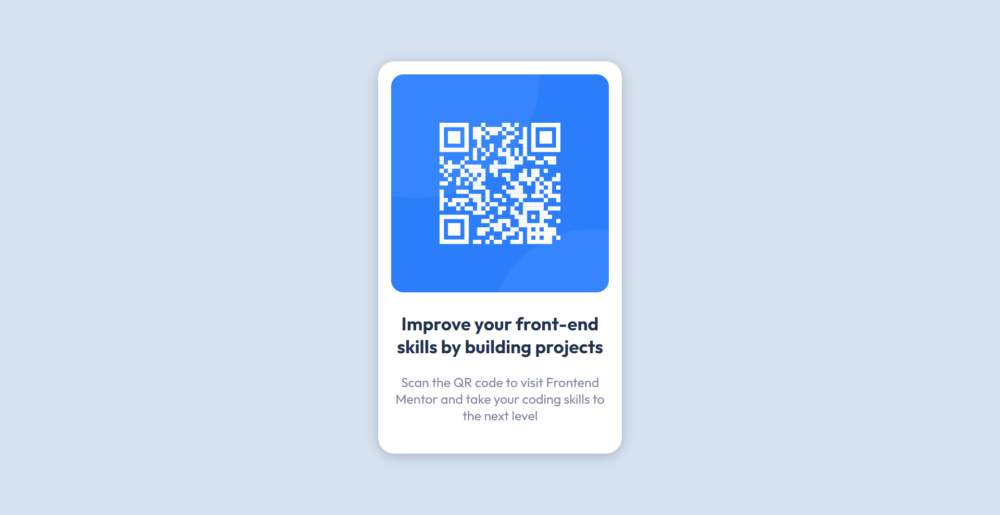

# Frontend Mentor - QR code component solution

This is a solution to the [QR code component challenge on Frontend Mentor](https://www.frontendmentor.io/challenges/qr-code-component-iux_sIO_H). Frontend Mentor challenges help you improve your coding skills by building realistic projects.

## Table of contents

- [Overview](#overview)
  - [Screenshot](#screenshot)
  - [Links](#links)
- [My process](#my-process)
  - [Built with](#built-with)
  - [What I learned](#what-i-learned)
  - [Continued development](#continued-development)
  - [Useful resources](#useful-resources)
- [Author](#author)
- [Acknowledgments](#acknowledgments)

## Overview

### Screenshot

### Links

Solution URL: https://github.com/artfeel92/FrontendMentor-QR-code-component
Live Site URL: https://artfeel92.github.io/FrontendMentor-QR-code-component/

## My process

### Built with

Pure HTML
CSS
Flexbox

### What I learned

I consolidated knowledge about the alignment of div elements on the page.

### Continued development

I should consolidate my markup knowledge and practice more. I need to work more with CSS units, especially rem, vh etc.

### Useful resources

https://www.w3schools.com/cssref/css_units.php - This is the article about CSS units
https://www.freecodecamp.org/news/how-to-center-anything-with-css-align-a-div-text-and-more/ - This is an amazing article about centering div.

## Author

Frontend Mentor - https://www.frontendmentor.io/profile/artfeel92

## Acknowledgments

https://www.youtube.com/watch?v=dXpYll1_42k&ab_channel=FrontendZone - This video helped me a lot.
